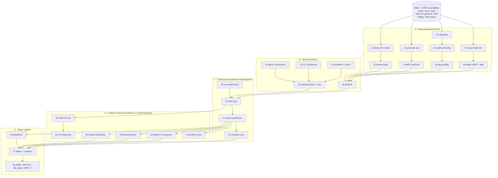

# TF-Layout

**Predicting Gene Responses to Transcription Factor Depletion from Promoter Binding Layouts in Yeast**

Long Jiang, Xiu-Hong Li\* — School of Computer Science and Technology, Xinjiang University
(\*corresponding author) · ICBCB 2027 submission

> Code, processed layout and label tables, the chromosome split, and per-pair test predictions for the paper.
>
> | Released | Not released |
> |---|---|
> | Code · processed layout / label / token tables · chromosome split · per-pair test predictions of the two reported models · frozen result tables · public auxiliary inputs in `data/` | ChEC-seq bigWig files (public at GEO, see [§6.2](#62-chec-seq-bigwig-files-not-included)) · trained checkpoints (retrain, see [§6.4](#64-model-checkpoints-not-released)) |
>
> Code comments, log messages and the `run_all.sh` header are written in Chinese.

---

## 1. What this is

Depleting a transcription factor (TF) changes many genes that lie far from its detectable binding sites, so binding alone is an incomplete guide to which genes respond. Using ChEC-seq maps of 178 TFs and 124 auxin-degron depletions in *S. cerevisiae* (Mahendrawada et al., *Nature* 2025), we ask **how much of a gene's response the binding layout of its promoter — which TFs bind where — can explain**, and whether a structured encoder of that layout adds anything over the same information flattened into features.

**Model.** A siamese Transformer (9.9 M parameters) encodes the wild-type layout `L_g` and the layout after removing every site of the depleted TF, `L_g \ D`, with one shared encoder. Three branches are fused by cross-attention:

| Branch | Input | Module |
|---|---|---|
| Layout | site tokens: TF identity, position to start codon, strand, ChEC-seq signal, motif score, anchoring type; per-head low-rank pairwise bias from TF-pair identity and distance | `10_layout_transformer.py` |
| cis | BPE tokens of promoter sequence (−1000…+500 bp around ATG), 6-layer RoPE Transformer | `12_cis_transformer.py`, `13_train_bpe.py` |
| Condition | marker over TF slots (depleted TF flagged) → FiLM scale/shift | `14_condition_fusion.py` |

Heads (`15_siamese_heads.py`): **A** wild-type log-expression; **B** log2 fold change = ŷ_D − ŷ_WT + ψ_corr(D, L_g) (Huber on responding pairs + auxiliary dense target on the rest); **C** direction down / unchanged / up from z_D − z_WT (class-balanced focal loss); a sign-consistency penalty couples B and C. The "+WT" variant feeds measured wild-type expression to Heads B and C only.

**Evaluation protocol.** Held-out chromosomes (test = chrXV/XVI: 820 genes, 101,680 pairs, 3,976 responders; val = chrXIII/XIV), within-TF metrics, tuned baselines (gradient boosting on flattened layout features, with and without measured expression), matched ensembling, gene-cluster bootstrap CIs, and an estimate of re-training variability.

## 2. Main results (test chromosomes)

| | r_B\|TF | AUROC dn | AUPRC dn | AUPRC up | within-TF AUROC dn |
|---|---|---|---|---|---|
| B4 pair + TF prior | 0.257 | 0.899 | 0.237 | 0.159 | 0.589 |
| B6 GBDT + WT expr. | 0.534 | 0.911 | 0.281 | 0.208 | 0.704 |
| B7a GBDT + flat layout | 0.548 | 0.918 | 0.338 | 0.242 | 0.750 |
| B7a-bag (5 × 80 %) | 0.558 | 0.921 | 0.357 | 0.248 | 0.761 |
| B7b-bag (+ WT expr.) | 0.650 | 0.928 | 0.384 | 0.283 | 0.793 |
| **Ours**, 1 seed (mean of 5) | 0.554 | 0.893 | 0.350 | 0.235 | 0.752 |
| **Ours**, 5-seed ensemble | 0.592 | 0.911 | 0.388 | 0.263 | 0.774 |
| **Ours + WT**, 5-seed ensemble | 0.661 | 0.925 | 0.426 | 0.287 | 0.813 |

With about 2 % responders per class, a random ranking has AUPRC ≈ 0.02. Full tables with 95 % CIs (†) and re-training-variability intervals (‡) are in the paper and in `out/results/_paper/`.

Findings:

1. **The layout is the main source of information.** Removing it causes the largest drop; gradient boosting on flattened layout features matches single neural models. The structured encoder keeps only a modest advantage (+0.031 down-regulation AUPRC over B7a-bag) after **matched ensembling**.
2. **Site deletion matters, and so does *which* sites are deleted.** Training without deletion lowers down-regulation AUPRC by 0.025; at inference, deleting another TF's sites instead of the depleted TF's lowers down/up AUPRC by 0.208 / 0.129.
3. **Measured wild-type expression helps more than model structure**; the +WT model is level with the strongest baseline (B7b-bag), and stacking the two shows complementary information.
4. **Limits:** no transfer to unseen TFs (leave-TF-out); positions act as distance to the start codon, at an effective resolution of ~100 bp. Promoter-sequence (cis) tokens have no measurable effect.

## 3. Project map



| Stage | Scripts | What happens | Main outputs (`out/`) |
|---|---|---|---|
| **A. Layout** | `01`–`04` | Parse Table S3A/B/C; call peak summits from replicate-normalised, free-MNase-subtracted ChEC-seq signal in bound promoters; anchor to a JASPAR 2024 / YeTFaSCo motif (one per TF, chosen by enrichment over shuffled sequence); merge sites of the same TF within 30 bp | `tf_layout.parquet` (214,329 sites, 5,373 promoters), `pair_spacing.parquet`, `sites.parquet`, `motif_choice.tsv` |
| **A. Labels** | `08` | Head A: log1p(TPM) z-scored on training genes; Head B/C: log2FC and down/ns/up per (gene, depleted TF); chromosome split | `head_a_baseline_logtpm.parquet` (has `split`), `head_bc_labels.parquet` |
| **A. cis** | `11`, `13` | Promoter windows −1000/+500 around ATG, strand-aware; BPE tokenizer (~4k vocab) | `promoter_seq.parquet`, `bpe_tokenizer.json`, `promoter_token_ids.parquet` |
| **A. Dense target** | `20`, `21` | Check, then build, a dense log2FC from replicate-mean TPM (calibrated to the published scale on training genes) as auxiliary Head B target | `head_b_dense_target.parquet`, `results/_dense_check/`, `results/_dense_target/` |
| **B. Model** | `09`, `10`, `12`, `14`, `15` | Dataset (WT / deleted layouts, condition marker, labels) and the network; each file has a CPU self-test | — |
| **C. Training** | `16`, `17`, `18`, `19` | `16` trains (AdamW, bf16, grouped forward); `18` runs named experiment presets (train → export → compare); `17` re-infers checkpoints and writes per-pair predictions, ensembles, metrics; `19` compares runs on common seeds with paired gene-cluster bootstrap | `checkpoints/<exp>/seed*_best.pt`, `results/<exp>/`, `results/_compare*/` |
| **D. Analyses** | `22`–`25`, `28`, `29` | `22`/`23` leave-TF-out and its diagnosis; `24` how positions are used; `25` Head A on all 1,108 test genes; `28` 2×2 inference-time deletion probe; `29` wrong-TF deletion control | `results/_lto2/`, `_lto_diag/`, `_pos_scan/`, `_head_a_all*/`, `_siamese_probe/`, `_spec_control/` |
| **E. Paper** | `26`, `27`, `fig_paper_*.py`, `figkit.py` | Tuned baselines B2–B7 (incl. bagged GBDT); paper tables, `paper_numbers.md`, synthetic re-training-variability intervals; Fig. 1 and Fig. 2 | `results/_baselines*/`, `results/_paper/` |
| **Legacy QC** | `00`, `05`, `06`, `07` | Phase-0 diagnostics of positional resolution (motif–summit offset SD ≈ 50 bp). Closed; run only with `--legacy-qc` | `fig/*.png` |

### Model lineage

Experiment names are the presets in `CONFIG["experiments"]` of `18_run_experiments.py`; `PLANS` groups them into batches.

| Name | Change | Role |
|---|---|---|
| `run1` | First 5-seed training (`--train` settings) | Starting point |
| `v2_full`, `v2_ce`, `v2_ctx_marker` | Training-side changes; Head C focal → plain cross-entropy; marker-style condition vector | Batch 2 |
| `v3_ce_marker_dense` | Cross-entropy + marker condition + dense auxiliary Head B target | Main line before `v8`; base of the position and leave-TF-out analyses |
| `v4_*`, `v5_*`, `v6_*` | Input ablations: no layout / no cis / no site deletion; no / shuffled / globally shifted positions | Position analyses cited in the paper (earlier configuration) |
| **`v8_headA_all`** | Head A trained and selected on all genes with an expression measurement | **Main model** (seeds 42, 123, 456, 789, 2024) |
| `v10_abl_*`, `v10_lambda_a03` | Ablations redone on `v8` | Table II |
| **`v11_wt_bc`** | `v8` + measured WT expression into Heads B/C only | **"+WT" model** |

## 4. Repository layout

```
.
├── scripts/tflayout/
│   ├── run_all.sh                 # pipeline driver; must stay in this directory (it cd's to ../..)
│   ├── 00_inventory.py … 29_deletion_specificity.py
│   ├── figkit.py                  # drawing helpers for the paper figures
│   ├── fig_paper_siamese.py       # Fig. 1
│   └── fig_paper_within_tf.py     # Fig. 2
├── data/                          # public inputs, see "Data" (ChEC-seq bigWig files are NOT included)
│   ├── 41586_2025_8916_MOESM5_ESM.xlsx
│   ├── tpm/                       # wild-type and per-depletion expression summaries
│   ├── motif/                     # JASPAR 2024 / YeTFaSCo PWMs
│   ├── S288C.fsa, SGD_features.tab, tss.bed
│   └── ChEC-seq/                  # only a README here; put the GEO bigWig files next to it to rebuild the layout
├── out/                           # processed tables and frozen results (small files only)
│   ├── tf_layout.parquet, head_bc_labels.parquet, head_a_baseline_logtpm.parquet, …
│   └── results/
│       ├── v8_headA_all/ , v11_wt_bc/     # per-pair predictions + metrics of the two reported models
│       ├── _paper/                        # tables.tex, paper_numbers.md, figures
│       └── _baselines/ , _compare*/ , _head_a_all*/ , _siamese_probe/ , _spec_control/ , …
├── requirements.txt
├── LICENSE
└── README.md
```

Scripts load each other by sibling path (e.g. `15` imports `10`/`12`/`14`), so keep all `NN_*.py` files together in `scripts/tflayout/`. Always run commands from the repository root.

## 5. Installation

```bash
python -m venv .venv && source .venv/bin/activate     # or conda
pip install -r requirements.txt
```

Python version, PyTorch/CUDA build and GPU used for the paper are listed at the top of `requirements.txt`. Training was run on a single RTX 3090 (24 GB); bf16 autocast is on by default. Data preparation, baselines, tables and figures need CPU only.

## 6. Data

Everything needed to train, evaluate and re-analyse the model is in this repository, with two exceptions: the **raw ChEC-seq bigWig files** (public at GEO, §6.2) and the **trained checkpoints** (§6.4).

### 6.1 Public inputs included in `data/`

| Path | Content | Source |
|---|---|---|
| `data/41586_2025_8916_MOESM5_ESM.xlsx` | Table S3 (sheets S3A binding, S3B occupancy, S3C log2FC) | Mahendrawada et al., *Nature* 642:796–804 (2025), supplementary data |
| `data/tpm/DMSO_expression.txt`, `DMSO_mean.txt`, `3IAA_mean.txt` | Wild-type TPM (median over DMSO controls) and per-depletion replicate means | ‹FILL 1: how these files were derived from the depletion RNA-seq, GEO GSE236947› |
| `data/S288C.fsa` | *S. cerevisiae* reference genome (sacCer3 / S288C) | SGD / NCBI |
| `data/SGD_features.tab` | SGD feature table (name → systematic name); also used for TF-name mapping in training and analysis | SGD |
| `data/tss.bed` | Anchor coordinates: ORF start codon, **not** the true TSS | ‹FILL 2: how this file was produced and from which annotation› |
| `data/motif/JASPAR2024_CORE_fungi_non-redundant_pfms_meme.txt`, `data/motif/ALIGNED_ENOLOGO_FORMAT_PWMS/` | Motif PWMs | JASPAR 2024, YeTFaSCo |

### 6.2 ChEC-seq bigWig files (not included)

| Path | Content | Source |
|---|---|---|
| `data/ChEC-seq/GSM*_<TF>_<A\|B\|C>.bw`, `GSM*_freeMNase_<A\|B>.bw` | ChEC-seq coverage, 178 TFs in triplicate + free-MNase control | GEO [GSE236944](https://www.ncbi.nlm.nih.gov/geo/query/acc.cgi?acc=GSE236944) (ChEC-seq). It belongs to SuperSeries [GSE236948](https://www.ncbi.nlm.nih.gov/geo/query/acc.cgi?acc=GSE236948), which also contains the depletion RNA-seq (GSE236947) |

These files are needed **only** to rebuild the layout table from raw signal (steps `01`–`04`). The processed layout in `out/` is enough for everything else. To rebuild it:

1. Download the bigWig files from the supplementary files of GSE236944 and keep their original `GSM…` file names.
2. Put them in `data/ChEC-seq/`.
3. Run `bash scripts/tflayout/run_all.sh --force` (`--force` reruns steps whose output files already exist).

### 6.3 Processed data released in `out/`

These files let the model be trained and evaluated without the raw bigWigs.

| File | Content |
|---|---|
| `out/tf_layout.parquet` | Layout table: one row per site — `gene_id, tf, site_pos, motif_strand, a, m, res_id, …`; positions in bp relative to the start codon, upstream negative |
| `out/head_bc_labels.parquet` | (gene, depleted TF) → `log2fc` (responders only), `direction_3class` |
| `out/head_a_baseline_logtpm.parquet` | Per-gene Head A target and `split` (train / val / test; val = chrXIII/XIV, test = chrXV/XVI) |
| `out/head_b_dense_target.parquet` | Auxiliary dense Head B target |
| `out/bpe_tokenizer.json`, `out/promoter_token_ids.parquet`, `out/promoter_seq.parquet` | BPE tokenizer, tokenised promoters (cis branch input), promoter sequences (6-mer baseline in `26`) |
| `out/results/v8_headA_all/predictions_test.parquet`, `out/results/v11_wt_bc/predictions_test.parquet` | Per-pair test predictions of the two reported models |
| `out/results/_paper/`, `_baselines/`, `_compare*/`, `_head_a_all*/`, `_siamese_probe/`, `_spec_control/`, … | Frozen result tables behind the paper (tables, numbers, figures) |

### 6.4 Model checkpoints (not released)

Checkpoints are not distributed. The per-pair test predictions of the two reported models are included, so the numbers in the paper can be checked without retraining. To obtain checkpoints, retrain with the commands in §7 (5 seeds per model, ≈ 73 min per seed on one RTX 3090). Training is seeded, but results will differ slightly (see the note at the end of §7).

### 6.5 What can be done with which inputs

| Goal | Needs | Command | Time |
|---|---|---|---|
| Use the layout, labels, tokenised promoters and per-pair test predictions | this repository | any parquet reader (e.g. `pandas.read_parquet`) | — |
| Regenerate paper tables and figures from the frozen results | CPU, this repository | `--tables`, then the two `fig_paper_*.py` | minutes |
| Re-fit the baselines B2–B7 | CPU, this repository | `--baselines` | ≈ 40 min |
| Retrain the models | GPU (RTX 3090, 24 GB) | `--experiments` | ≈ 73 min per seed |
| Re-run the checkpoint-based analyses (`--export`, `--head-a-all`, `--probe`, `--spec-control`, `--pos-scan`) | checkpoints from your own training run | the switches in §7 | minutes |
| Rebuild the layout table from raw signal | bigWig files from GEO (§6.2) | `--force` | — |

## 7. Usage

`run_all.sh` is the single entry point. Steps whose output files already exist are skipped (`--force` reruns them); each step logs to `out/logs/<step>.log`. `--help` prints the script header (usage and change notes, in Chinese). On a fresh clone the processed outputs of steps `01`–`04` are already in `out/`, so those steps are skipped and `data/ChEC-seq/` is not needed.

```bash
# 1. Data preparation (01–04, 08, 11, 13) + Dataset check + architecture self-tests
bash scripts/tflayout/run_all.sh

# 2. Optional sanity checks before training
bash scripts/tflayout/run_all.sh --loop-selftest --skip-arch-selftest   # fake data, CPU
bash scripts/tflayout/run_all.sh --smoke --skip-arch-selftest           # 1 epoch, 1 seed, real data

# 3. Dense auxiliary target (needed by the v3/v8/v11 presets)
bash scripts/tflayout/run_all.sh --dense-check --dense-target --skip-arch-selftest

# 4. Train the experiment plan set in ACTIVE_PLAN of 18_run_experiments.py
#    (each experiment: smoke test → training → export → comparison)
bash scripts/tflayout/run_all.sh --experiments --skip-arch-selftest
```

Experiment settings are **not** command-line arguments: they live in the `CONFIG` / `PLANS` / `ACTIVE_PLAN` blocks at the top of scripts `16`–`29`. To train something else, edit `ACTIVE_PLAN` in `18_run_experiments.py` (presets in its `CONFIG["experiments"]`) (e.g. `("b8b_headA_all5",)` for the main model, `("b12b_wt_main5",)` for `v11_wt_bc`). `--train` is a separate legacy path that reproduces the `run1` settings under `out/checkpoints/cli_train/`.

Other switches: `--export` (17), `--compare` (19), `--lto` / `--lto-diag` (22/23), `--pos-scan` (24), `--head-a-all` (25), `--probe` (28), `--spec-control` (29), `--baselines` (26), `--tables` (27), `--bench` (throughput measurement), `--legacy-qc`.

### Reproducing the paper

No GPU? The released predictions and frozen results let you regenerate the paper tables without retraining (§6.5). Approximate order for a full reproduction, with GPU times as estimated in the script comments (≈ 73 min per seed for the main model on an RTX 3090, as in the paper):

1. Steps 1 and 3 above.
2. Train `v8_headA_all` (plans `b8a_headA_all`, `b8b_headA_all5`), the `v10_*` ablations (`b10a_ablate_v8`, `b10b_lambda_a`, `b11a_knockout5`) and `v11_wt_bc` (`b12b_wt_main5`) by setting `ACTIVE_PLAN` and running `--experiments`.
3. `--head-a-all`, `--probe`, `--spec-control` (inference only, minutes), then `--baselines` (CPU, ≈ 40 min).
   `26_paper_baselines.py` currently points at `v11_wt_bc` / `out/results/_baselines_v11`; the frozen paper tables read `out/results/_baselines`, produced with `model_run="v8_headA_all"` (see the comment above `model_run` in its `CONFIG`).
4. `--tables` (CPU, minutes) → `out/results/_paper/{tables.tex, paper_numbers.md, summary.txt}`.
5. Figures: `python scripts/tflayout/fig_paper_siamese.py` (run inside `scripts/tflayout/`, needs `figkit.py`) and `python scripts/tflayout/fig_paper_within_tf.py` (reads `paper_numbers.md`).

Training is seeded (42, 123, 456, 789, 2024), but bf16 and GPU kernels are not bit-wise deterministic; expect differences on the order of the re-training variability reported in the paper (≈ 0.003–0.007 on the main metrics).

## 8. Citation

```bibtex
@misc{jiang2027tflayout,
  title        = {Predicting Gene Responses to Transcription Factor Depletion from Promoter Binding Layouts in Yeast},
  author       = {Jiang, Long and Li, Xiu-Hong},
  howpublished = {\url{https://github.com/JL0430/TF-Layout}},
  note         = {Manuscript under review; the citation will be updated after publication}
}
```

If you use the data, please also cite the sources of the inputs:

- Mahendrawada, Warfield, Donczew and Hahn, *Nature* 642(8068):796–804 (2025) — ChEC-seq binding maps, depletion RNA-seq, Table S3.
- Rauluseviciute et al., JASPAR 2024, *Nucleic Acids Res.* 52(D1):D174–D182 (2024) — motif matrices.
- de Boer and Hughes, YeTFaSCo, *Nucleic Acids Res.* 40(D1):D169–D179 (2012) — motif matrices.
- Saccharomyces Genome Database (yeastgenome.org) — reference genome and feature table.

## 9. License and acknowledgment

**Code** (`scripts/`) is released under the MIT License, see `LICENSE`.

**Data.** The processed tables in `out/` are derived from the public sources listed in §6 and are provided for research reproducibility. Third-party files in `data/` (Table S3, motif matrices, genome, annotation) keep the terms of their original sources; please follow those terms and cite the sources (§8).

We thank Mahendrawada et al. for making their data public. LLM assistants (Claude and ChatGPT) helped draft the analysis code and edit the text; the authors verified all content and take full responsibility for it.
